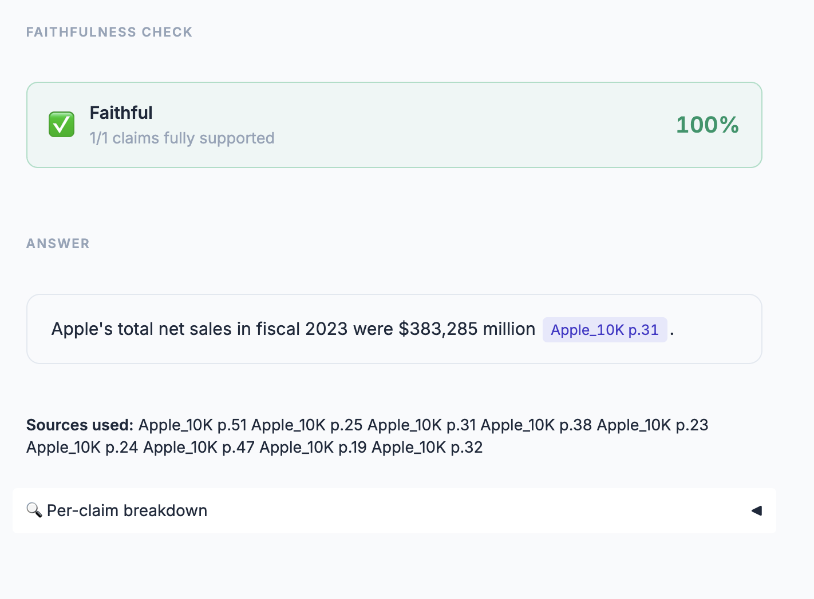
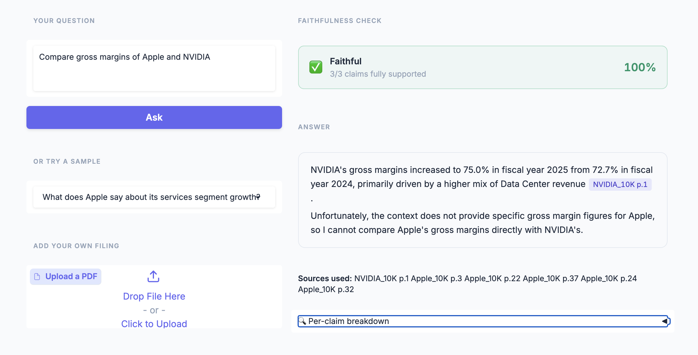
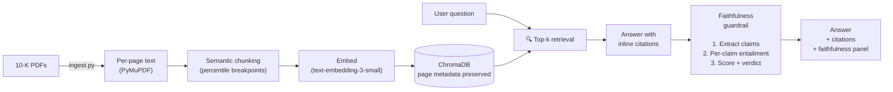
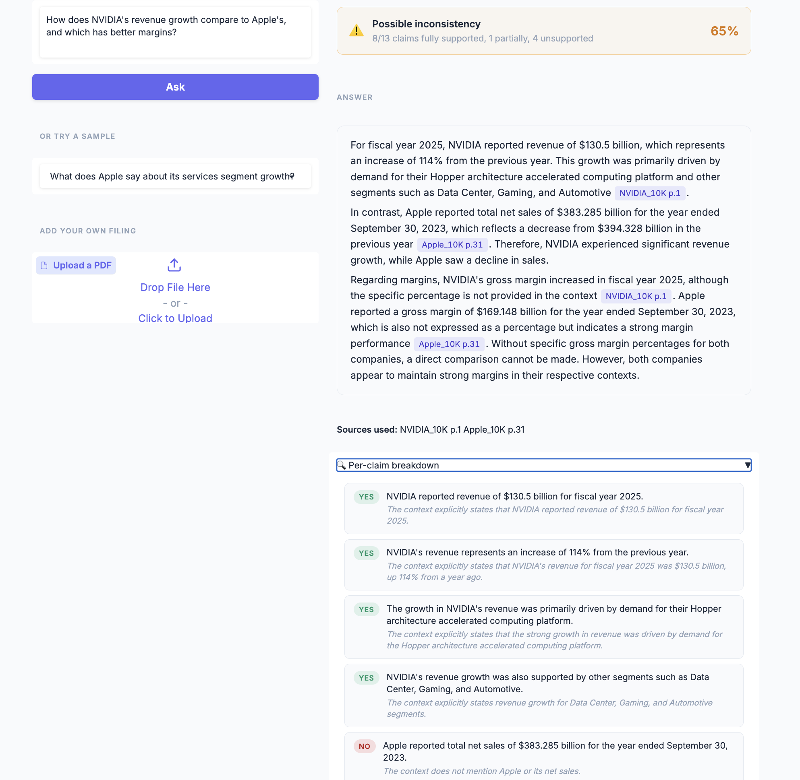

# Financial Document Q&A with Citations

> Ask questions about SEC 10-K filings (Apple, Tesla, NVIDIA bundled — or upload your own) and get answers grounded in the source documents. Every claim is tagged with **inline page-level citations** linking back to the original filing, and a **two-stage faithfulness guardrail** extracts each atomic claim from the answer and checks it against the retrieved context — flagging soft inconsistencies and blocking outright hallucinations. Ships as both a Gradio UI for demos and a FastAPI service for headless integration.



---

##  What it does

- **Ingests SEC 10-K filings** (Apple & Tesla bundled) using **semantic chunking** — chunks end at natural section boundaries instead of arbitrary character counts
- **Returns answers with page-level citations** — every claim is tagged `[Apple_10K p.47]` so users can verify against the original PDF
- **Two-stage faithfulness guardrail** — extracts atomic claims from the answer, then judges each one against the retrieved context. Score below 0.6 → block. 0.6–0.85 → flag. Above 0.85 → green.
- **Ships as both a Gradio UI and a FastAPI service** — same pipeline, two deployment surfaces

### Cross-document Q&A in action



Citations visibly mix `[Apple_10K]` and `[NVIDIA_10K]` — proof that the retriever is correctly combining sources, not anchoring to one document.

##  Architecture



Two surfaces, one pipeline:
- **Gradio UI** (`app.py`) — for demos and interactive exploration
- **FastAPI service** (`server.py`) — for headless integration with other systems

## 🚦 Quick start

### Prerequisites
- Python 3.10+
- An OpenAI API key
- Internet access on first run (auto-downloads bundled SEC filings)

### Setup

```bash
git clone https://github.com/ghaderimaryam/financial-qa.git
cd financial-qa

python3.11 -m venv .venv
source .venv/bin/activate          # Windows: .venv\Scripts\activate
pip install --upgrade pip
pip install -r requirements.txt

cp .env.example .env
# edit .env, paste your OPENAI_API_KEY
```

### Build the index

```bash
python ingest.py
```

On first run this auto-downloads Apple's and Tesla's most recent 10-Ks (if not already present), extracts page-level text, semantically chunks it, embeds, and persists to ChromaDB. ~$0.05 in OpenAI usage on the bundled filings.

### Launch the Gradio UI

```bash
python app.py
```

Browser opens automatically. Try a sample question or upload your own PDF to extend the index.

### Launch the FastAPI service

```bash
uvicorn server:app --reload
```

Then:
```bash
curl -X POST http://localhost:8000/ask \
  -H "Content-Type: application/json" \
  -d '{"question": "What were Apple total net sales in fiscal 2023?"}'
```

Interactive Swagger docs at http://localhost:8000/docs.

## 📁 Project structure

```
financial-qa/
├── app.py                    # Gradio UI entry point
├── server.py                 # FastAPI service entry point
├── ingest.py                 # CLI: PDFs → chunks → vector index
├── src/
│   ├── config.py             # Paths, models, thresholds
│   ├── pdf_loader.py         # PyMuPDF page-aware extraction
│   ├── chunker.py            # Semantic chunking (percentile breakpoints)
│   ├── vector_store.py       # ChromaDB build/load
│   ├── retrieval.py          # Top-k retrieval with citation metadata
│   ├── qa_chain.py           # Strict citation prompt + LLM call
│   ├── faithfulness.py       #  Two-stage guardrail
│   ├── pipeline.py           # End-to-end: retrieve → answer → check
│   └── ui.py                 # Gradio Blocks layout
├── data/
│   ├── pdfs/                 # Source PDFs (auto-downloaded, gitignored)
│   └── chroma_db/            # Vector index (generated, gitignored)
├── docs/                     # Screenshots
├── .env.example
├── .gitignore
├── LICENSE
├── requirements.txt
└── README.md
```

##  The faithfulness guardrail

This is the part that separates this project from a typical RAG demo. Most "faithfulness checks" in tutorials are a single LLM call asking *"is this answer faithful?"* — which is circular and unstable.

This system uses a **two-stage check** modeled after Ragas / TruLens:

**Stage 1 — Claim extraction.** The answer is decomposed into atomic factual claims. *"Apple's R&D was $30B and rose 14% YoY"* → `["Apple's R&D was $30B", "Apple's R&D rose 14% YoY"]`.

**Stage 2 — Per-claim entailment.** Each claim is judged against the retrieved context with `temperature=0`:
- `yes` → fully and explicitly supported
- `partial` → topic mentioned but a number/qualifier is off
- `no` → contradicted or unmentioned

**Score:** `(yes + 0.5 × partial) / total claims`.

Three thresholds (configurable via `.env`):
- **`green`** ≥ 0.85 — answer served as-is
- **`yellow`** 0.6–0.85 — answer served with a warning banner
- **`red`** < 0.6 — answer **blocked**, replaced with a transparent refusal

The UI shows the score, the verdict banner, and a per-claim breakdown so users can see exactly which claim was unsupported. This is what makes the guardrail actionable instead of decorative.


##  Tech stack

| Layer | Choice | Why |
|-------|--------|-----|
| LLM | OpenAI `gpt-4o-mini` | Cheap and consistent for both QA and judging |
| Embeddings | OpenAI `text-embedding-3-small` | Strong quality-to-cost ratio |
| Chunking | Custom semantic splitter | Fixed-size splitters destroy financial-doc structure |
| PDF parsing | PyMuPDF | Faster + better Unicode + per-page text extraction |
| Vector store | ChromaDB | Zero-infra, file-based, drop-in with LangChain |
| API | FastAPI + Pydantic | Auto-generated Swagger UI, type-checked schemas |
| UI | Gradio 6 | Polished demo UI in ~200 lines |

##  Configuration

Every knob is in `src/config.py`, overridable via `.env`:

| Variable | Default | Purpose |
|----------|---------|---------|
| `OPENAI_API_KEY` | — | Required |
| `MODEL_GEN` | `gpt-4o-mini` | Answer generation |
| `MODEL_JUDGE` | `gpt-4o-mini` | Claim extraction + entailment |
| `MODEL_EMBED` | `text-embedding-3-small` | Embeddings |
| `TOP_K` | `6` | Retrieval depth |
| `FAITHFULNESS_BLOCK_BELOW` | `0.6` | Below this score → block |
| `FAITHFULNESS_WARN_BELOW` | `0.85` | Below this score → flag |

##  Roadmap

- [ ] Streaming token-by-token answers in Gradio
- [ ] Hybrid retrieval (BM25 + dense) for queries with exact figure lookups
- [ ] Cache faithfulness checks per (answer, context) hash to save tokens
- [ ] Highlight cited spans inside the original PDF
- [ ] Dockerfile for one-command deploy

##  License

MIT — see [LICENSE](LICENSE).

## 👤 Author

**Maryam Ghaderi** — [GitHub](https://github.com/ghaderimaryam)
